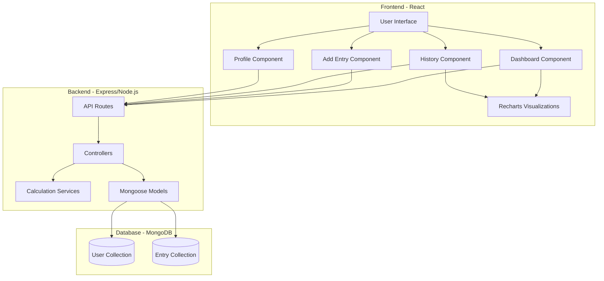

# Design Document: Carbon Footprint Tracker

## Overview

The Carbon Footprint Tracker is a full-stack web application that enables users to monitor and reduce their environmental impact through comprehensive tracking of carbon-generating activities (vehicles, plastics, heating) and carbon-offsetting activities (tree plantations). The system features a React frontend with a green/white color scheme, an Express/Node.js backend API, and MongoDB for data persistence.

### Key Design Principles

1. **User-Centric Design**: Intuitive interface with clear visual feedback for all actions
2. **Data Accuracy**: Use scientifically-backed emission factors for calculations
3. **Progressive Disclosure**: Show summary data upfront, detailed breakdowns on demand
4. **Positive Reinforcement**: Emphasize improvements and rewards (Eco Points) to encourage sustainable behavior
5. **Performance**: Fast data entry and instant feedback on carbon impact

## Architecture

### System Architecture Diagram



### Technology Stack

**Frontend:**
- React 18.2.0 (Create React App)
- Axios for HTTP requests
- Recharts for data visualization
- CSS3 with custom green/white theme

**Backend:**
- Node.js with Express 4.18
- Mongoose 7.0 for MongoDB ODM
- Body-parser for JSON parsing
- CORS enabled for cross-origin requests

**Database:**
- MongoDB for document storage

## Components and Interfaces

### Frontend Components

#### 1. App Component (Root)
- **Purpose**: Main application shell with routing and theme
- **State**: Current user, authentication status
- **Props**: None (root component)
- **Key Features**:
  - Green (#2E7D32, #4CAF50, #81C784) and white (#FFFFFF, #F1F8E9) color palette
  - Navigation bar with logo and menu items
  - Route management for Dashboard, Add Entry, History, Profile

#### 2. Dashboard Component
- **Purpose**: Overview of current carbon footprint and recent activity
- **State**: Total emissions, total offsets, net footprint, eco points, recent entries
- **API Calls**:
  - `GET /api/dashboard/summary` - Fetch summary statistics
  - `GET /api/entries/recent` - Fetch last 7 days of entries
- **Key Features**:
  - Large stat cards showing:
    - Total CO2 Emissions (kg)
    - CO2 Offset from Trees (kg)
    - Net Carbon Footprint (kg)
    - Eco Points Earned
  - Quick action buttons for adding entries
  - Mini chart showing 7-day trend
  - Color coding: Red/orange for high emissions, green for improvements

#### 3. AddEntry Component
- **Purpose**: Form for logging emissions and plantations
- **State**: Entry type, form data, validation errors
- **API Calls**:
  - `POST /api/entries/vehicle` - Submit vehicle entry
  - `POST /api/entries/plastic` - Submit plastic entry
  - `POST /api/entries/energy` - Submit energy entry
  - `POST /api/entries/plantation` - Submit plantation entry
- **Key Features**:
  - Tab-based interface for entry types (Vehicles, Plastics, Energy, Plantations)
  - Dynamic forms based on entry type
  - Real-time CO2 calculation preview
  - Success feedback with calculated emissions/offsets
  - Icons for each category (🚗 🛢️ ♻️ 🌳)

**Vehicle Form Fields:**
- Distance (km)
- Fuel type (dropdown: Petrol, Diesel, Electric, Hybrid, CNG)
- Date (default: today)
- Optional: Vehicle name/description

**Plastic Form Fields:**
- Plastic type (dropdown: Single-use, Bottles, Bags, Packaging)
- Quantity (kg or units)
- Date (default: today)

**Energy Form Fields:**
- Energy source (dropdown: Natural Gas, Electricity, Heating Oil, Coal)
- Amount (kWh)
- Renewable source checkbox (sets emissions to 0)
- Date (default: today)

**Plantation Form Fields:**
- Number of trees planted
- Date (default: today)
- Optional: Location/notes

#### 4. History Component
- **Purpose**: Historical data visualization and analysis
- **State**: Time range, filter type, historical data, weekly stats
- **API Calls**:
  - `GET /api/entries/history?weeks=12&type=all` - Fetch historical entries
  - `GET /api/analytics/weekly` - Fetch weekly aggregated data
- **Key Features**:
  - Line chart showing 12-week emission trends (Recharts)
  - Filter buttons: All, Vehicles, Plastics, Energy, Plantations
  - Weekly comparison cards showing:
    - This week's emissions
    - Last week's emissions
    - Percentage change (green if improved, red if worse)
  - Breakdown by category (pie chart or bar chart)
  - Export to CSV button

#### 5. Profile Component
- **Purpose**: User statistics and achievements
- **State**: User data, lifetime stats, achievements
- **API Calls**:
  - `GET /api/user/profile` - Fetch user profile and stats
  - `GET /api/user/achievements` - Fetch earned achievements
- **Key Features**:
  - Lifetime statistics:
    - Total entries logged
    - Total CO2 emissions
    - Total CO2 offset
    - Total Eco Points
    - Trees planted
  - Achievement badges (visual rewards)
  - Data export functionality
  - Account settings

### Backend API Endpoints

#### Entry Management

**POST /api/entries/vehicle**
```json
Request:
{
  "distance": 50,
  "fuelType": "petrol",
  "date": "2025-12-05",
  "description": "Commute to work"
}

Response:
{
  "success": true,
  "entry": {
    "_id": "...",
    "type": "vehicle",
    "co2Emissions": 9.24,
    "details": { ... },
    "createdAt": "2025-12-05T10:30:00Z"
  }
}
```

**POST /api/entries/plastic**
```json
Request:
{
  "plasticType": "bottles",
  "quantity": 0.5,
  "unit": "kg",
  "date": "2025-12-05"
}

Response:
{
  "success": true,
  "entry": {
    "_id": "...",
    "type": "plastic",
    "co2Emissions": 3.0,
    "details": { ... },
    "createdAt": "2025-12-05T10:30:00Z"
  }
}
```

**POST /api/entries/energy**
```json
Request:
{
  "energySource": "electricity",
  "amount": 100,
  "isRenewable": false,
  "date": "2025-12-05"
}

Response:
{
  "success": true,
  "entry": {
    "_id": "...",
    "type": "energy",
    "co2Emissions": 42.0,
    "details": { ... },
    "createdAt": "2025-12-05T10:30:00Z"
  }
}
```

**POST /api/entries/plantation**
```json
Request:
{
  "treesPlanted": 5,
  "date": "2025-12-05",
  "location": "Local park"
}

Response:
{
  "success": true,
  "entry": {
    "_id": "...",
    "type": "plantation",
    "co2Offset": 110.0,
    "ecoPointsEarned": 50,
    "details": { ... },
    "createdAt": "2025-12-05T10:30:00Z"
  }
}
```

**GET /api/entries/history**
Query params: `weeks` (default: 12), `type` (default: all)
```json
Response:
{
  "success": true,
  "entries": [
    {
      "_id": "...",
      "type": "vehicle",
      "co2Emissions": 9.24,
      "date": "2025-12-05",
      "details": { ... }
    },
    ...
  ],
  "totalEmissions": 450.5,
  "totalOffsets": 220.0,
  "netFootprint": 230.5
}
```

#### Dashboard & Analytics

**GET /api/dashboard/summary**
```json
Response:
{
  "success": true,
  "summary": {
    "totalEmissions": 450.5,
    "totalOffsets": 220.0,
    "netFootprint": 230.5,
    "ecoPoints": 150,
    "entriesCount": 45,
    "treesPlanted": 15
  }
}
```

**GET /api/analytics/weekly**
```json
Response:
{
  "success": true,
  "weeklyData": [
    {
      "week": "2025-W48",
      "startDate": "2025-11-25",
      "endDate": "2025-12-01",
      "emissions": 45.2,
      "offsets": 22.0,
      "netFootprint": 23.2
    },
    ...
  ],
  "percentageChange": -12.5
}
```

**GET /api/user/profile**
```json
Response:
{
  "success": true,
  "user": {
    "_id": "...",
    "lifetimeStats": {
      "totalEmissions": 1250.5,
      "totalOffsets": 550.0,
      "ecoPoints": 380,
      "treesPlanted": 38,
      "entriesLogged": 156
    },
    "joinedDate": "2025-01-15"
  }
}
```

## Data Models

### Entry Model (MongoDB Schema)

```javascript
const EntrySchema = new mongoose.Schema({
  userId: {
    type: mongoose.Schema.Types.ObjectId,
    ref: 'User',
    required: true,
    index: true
  },
  type: {
    type: String,
    enum: ['vehicle', 'plastic', 'energy', 'plantation'],
    required: true
  },
  date: {
    type: Date,
    required: true,
    default: Date.now,
    index: true
  },
  co2Emissions: {
    type: Number,
    default: 0,
    min: 0
  },
  co2Offset: {
    type: Number,
    default: 0,
    min: 0
  },
  ecoPointsEarned: {
    type: Number,
    default: 0,
    min: 0
  },
  details: {
    type: mongoose.Schema.Types.Mixed,
    required: true
  },
  createdAt: {
    type: Date,
    default: Date.now
  }
});
```

**Details Field Structure by Type:**

**Vehicle:**
```javascript
{
  distance: Number,        // km
  fuelType: String,        // petrol, diesel, electric, hybrid, cng
  fuelConsumption: Number, // liters or kWh
  description: String
}
```

**Plastic:**
```javascript
{
  plasticType: String,  // single-use, bottles, bags, packaging
  quantity: Number,     // kg
  unit: String         // kg or units
}
```

**Energy:**
```javascript
{
  energySource: String, // natural-gas, electricity, heating-oil, coal
  amount: Number,       // kWh
  isRenewable: Boolean
}
```

**Plantation:**
```javascript
{
  treesPlanted: Number,
  location: String,
  notes: String
}
```

### User Model (MongoDB Schema)

```javascript
const UserSchema = new mongoose.Schema({
  email: {
    type: String,
    required: true,
    unique: true,
    lowercase: true
  },
  name: {
    type: String,
    required: true
  },
  lifetimeStats: {
    totalEmissions: { type: Number, default: 0 },
    totalOffsets: { type: Number, default: 0 },
    ecoPoints: { type: Number, default: 0 },
    treesPlanted: { type: Number, default: 0 },
    entriesLogged: { type: Number, default: 0 }
  },
  createdAt: {
    type: Date,
    default: Date.now
  },
  updatedAt: {
    type: Date,
    default: Date.now
  }
});
```

## Calculation Services

### EmissionCalculator Service

**Purpose**: Calculate CO2 emissions based on activity type and input data

**Methods:**

```javascript
class EmissionCalculator {
  // Vehicle emissions
  static calculateVehicleEmissions(distance, fuelType) {
    const emissionFactors = {
      petrol: { co2PerLiter: 2.31, consumptionPerKm: 0.08 },
      diesel: { co2PerLiter: 2.68, consumptionPerKm: 0.07 },
      electric: { co2PerKwh: 0.42, consumptionPerKm: 0.2 },
      hybrid: { co2PerLiter: 1.5, consumptionPerKm: 0.05 },
      cng: { co2PerKg: 2.75, consumptionPerKm: 0.06 }
    };
    
    const factor = emissionFactors[fuelType];
    const fuelConsumed = distance * factor.consumptionPerKm;
    const co2 = fuelConsumed * (factor.co2PerLiter || factor.co2PerKwh || factor.co2PerKg);
    
    return {
      co2Emissions: parseFloat(co2.toFixed(2)),
      fuelConsumed: parseFloat(fuelConsumed.toFixed(2))
    };
  }
  
  // Plastic emissions
  static calculatePlasticEmissions(quantity, plasticType) {
    const emissionFactors = {
      'single-use': 6.0,
      'bottles': 6.0,
      'bags': 6.0,
      'packaging': 6.0
    };
    
    const co2 = quantity * emissionFactors[plasticType];
    return parseFloat(co2.toFixed(2));
  }
  
  // Energy emissions
  static calculateEnergyEmissions(amount, energySource, isRenewable) {
    if (isRenewable) return 0;
    
    const emissionFactors = {
      'natural-gas': 0.18,
      'electricity': 0.42,
      'heating-oil': 0.27,
      'coal': 0.34
    };
    
    const co2 = amount * emissionFactors[energySource];
    return parseFloat(co2.toFixed(2));
  }
  
  // Tree plantation offset
  static calculateTreeOffset(treesPlanted) {
    const co2PerTreePerYear = 22; // kg CO2 absorbed per tree per year
    const co2Offset = treesPlanted * co2PerTreePerYear;
    const ecoPoints = treesPlanted * 10;
    
    return {
      co2Offset: parseFloat(co2Offset.toFixed(2)),
      ecoPoints: ecoPoints
    };
  }
}
```

### AnalyticsService

**Purpose**: Aggregate and analyze historical data

**Methods:**

```javascript
class AnalyticsService {
  // Get weekly aggregated data
  static async getWeeklyData(userId, weeks = 12) {
    const startDate = new Date();
    startDate.setDate(startDate.getDate() - (weeks * 7));
    
    // Aggregate entries by week
    const weeklyData = await Entry.aggregate([
      {
        $match: {
          userId: mongoose.Types.ObjectId(userId),
          date: { $gte: startDate }
        }
      },
      {
        $group: {
          _id: {
            year: { $year: "$date" },
            week: { $week: "$date" }
          },
          emissions: { $sum: "$co2Emissions" },
          offsets: { $sum: "$co2Offset" },
          entries: { $push: "$$ROOT" }
        }
      },
      {
        $sort: { "_id.year": 1, "_id.week": 1 }
      }
    ]);
    
    return weeklyData.map(week => ({
      week: `${week._id.year}-W${week._id.week}`,
      emissions: parseFloat(week.emissions.toFixed(2)),
      offsets: parseFloat(week.offsets.toFixed(2)),
      netFootprint: parseFloat((week.emissions - week.offsets).toFixed(2))
    }));
  }
  
  // Calculate percentage change
  static calculatePercentageChange(current, previous) {
    if (previous === 0) return current > 0 ? 100 : 0;
    return parseFloat((((current - previous) / previous) * 100).toFixed(1));
  }
  
  // Get breakdown by category
  static async getCategoryBreakdown(userId, startDate, endDate) {
    const breakdown = await Entry.aggregate([
      {
        $match: {
          userId: mongoose.Types.ObjectId(userId),
          date: { $gte: startDate, $lte: endDate }
        }
      },
      {
        $group: {
          _id: "$type",
          totalEmissions: { $sum: "$co2Emissions" },
          totalOffsets: { $sum: "$co2Offset" },
          count: { $sum: 1 }
        }
      }
    ]);
    
    return breakdown;
  }
}
```

## Error Handling

### Frontend Error Handling

1. **Network Errors**: Display user-friendly message with retry option
2. **Validation Errors**: Inline form validation with red text and icons
3. **API Errors**: Toast notifications for failed operations
4. **Loading States**: Skeleton screens and spinners during data fetch

### Backend Error Handling

```javascript
// Centralized error handler middleware
app.use((err, req, res, next) => {
  console.error(err.stack);
  
  const statusCode = err.statusCode || 500;
  const message = err.message || 'Internal Server Error';
  
  res.status(statusCode).json({
    success: false,
    error: message,
    ...(process.env.NODE_ENV === 'development' && { stack: err.stack })
  });
});

// Validation error handler
class ValidationError extends Error {
  constructor(message) {
    super(message);
    this.statusCode = 400;
    this.name = 'ValidationError';
  }
}

// Not found error handler
class NotFoundError extends Error {
  constructor(message) {
    super(message);
    this.statusCode = 404;
    this.name = 'NotFoundError';
  }
}
```

## Testing Strategy

### Frontend Testing

1. **Component Tests**: Jest + React Testing Library
   - Test each component renders correctly
   - Test form submissions and validations
   - Test user interactions (button clicks, form inputs)
   - Test API integration with mocked responses

2. **Integration Tests**:
   - Test complete user flows (add entry → view dashboard → check history)
   - Test navigation between components
   - Test data persistence across component remounts

3. **Visual Tests**:
   - Verify green/white color scheme consistency
   - Test responsive design on different screen sizes
   - Verify chart rendering with sample data

### Backend Testing

1. **Unit Tests**: Jest
   - Test EmissionCalculator methods with various inputs
   - Test AnalyticsService aggregation logic
   - Test model validation rules

2. **API Tests**: Supertest
   - Test all endpoints with valid/invalid data
   - Test error responses
   - Test data persistence in database

3. **Integration Tests**:
   - Test complete workflows (create entry → fetch dashboard → get history)
   - Test database operations
   - Test calculation accuracy

### Test Data

**Sample Emission Factors (for validation):**
- Petrol vehicle 100km: ~18.48 kg CO2
- Diesel vehicle 100km: ~18.76 kg CO2
- 1kg plastic: 6 kg CO2
- 100 kWh electricity: 42 kg CO2
- 1 tree planted: -22 kg CO2, +10 points

## UI/UX Design Specifications

### Color Palette

**Primary Colors:**
- Dark Green: `#2E7D32` (primary actions, headers)
- Medium Green: `#4CAF50` (accents, positive feedback)
- Light Green: `#81C784` (hover states, secondary elements)
- Very Light Green: `#F1F8E9` (backgrounds, cards)

**Neutral Colors:**
- White: `#FFFFFF` (main background)
- Light Gray: `#F5F5F5` (section backgrounds)
- Medium Gray: `#757575` (secondary text)
- Dark Gray: `#212121` (primary text)

**Feedback Colors:**
- Success: `#4CAF50` (green)
- Warning: `#FF9800` (orange)
- Error: `#F44336` (red)
- Info: `#2196F3` (blue)

### Typography

- **Headings**: System font stack (San Francisco, Segoe UI, Roboto)
- **Body**: System font stack
- **Sizes**:
  - H1: 2.5rem (40px)
  - H2: 2rem (32px)
  - H3: 1.5rem (24px)
  - Body: 1rem (16px)
  - Small: 0.875rem (14px)

### Component Styling

**Buttons:**
- Primary: Dark green background, white text, rounded corners (8px)
- Secondary: White background, dark green border and text
- Hover: Lighten by 10%
- Padding: 12px 24px

**Cards:**
- White background
- Light shadow: `0 2px 8px rgba(0,0,0,0.1)`
- Border radius: 12px
- Padding: 24px

**Forms:**
- Input fields: Light gray border, rounded corners (8px)
- Focus state: Dark green border
- Labels: Medium gray, 14px
- Error state: Red border and text

### Icons

Use emoji or icon library (e.g., React Icons):
- 🚗 Vehicle
- ♻️ Plastic
- 🔥 Energy
- 🌳 Tree/Plantation
- 📊 Analytics
- 👤 Profile

## Performance Considerations

1. **Frontend Optimization**:
   - Lazy load History component (large data sets)
   - Debounce form inputs for real-time calculations
   - Cache dashboard summary for 5 minutes
   - Optimize Recharts rendering with data sampling for large datasets

2. **Backend Optimization**:
   - Index MongoDB fields: userId, date, type
   - Cache weekly analytics for 1 hour
   - Limit history queries to 12 weeks by default
   - Use aggregation pipelines for analytics

3. **Database Optimization**:
   - Compound index on (userId, date)
   - TTL index for old entries (optional, after 2 years)
   - Regular aggregation for user lifetime stats

## Security Considerations

1. **Input Validation**: Validate all user inputs on both frontend and backend
2. **Data Sanitization**: Sanitize user inputs to prevent injection attacks
3. **Rate Limiting**: Limit API requests to prevent abuse
4. **CORS**: Configure CORS to allow only frontend origin
5. **Environment Variables**: Store sensitive data (MongoDB URI) in environment variables

## Future Enhancements

1. **User Authentication**: Add login/signup with JWT tokens
2. **Social Features**: Compare footprint with friends, leaderboards
3. **Achievements System**: Badges for milestones (100 trees, 1000 points, etc.)
4. **ML Integration**: Use existing ML service for predictions and recommendations
5. **Mobile App**: React Native version
6. **Notifications**: Reminders to log daily activities
7. **Carbon Offset Marketplace**: Purchase carbon credits
8. **Community Challenges**: Group goals and competitions
